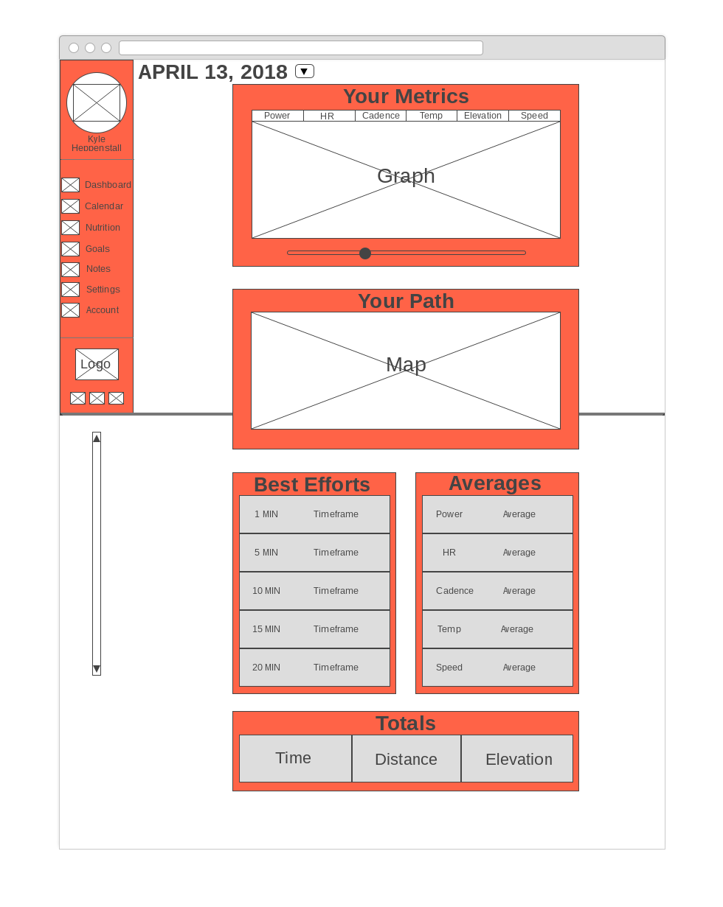
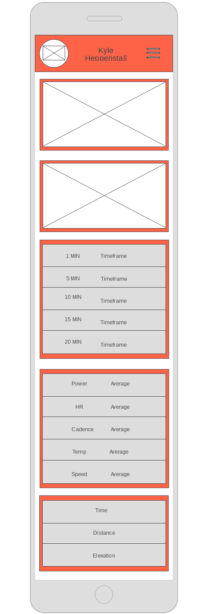

# TempoTrainer
An application for going the distance

## Peaksware Javascript Code Test
Please build a single page application to visualize the workout data provided in `workout-data.json`, including a map, a graph, and an algorithm to analyze average power output.


## Wireframes

#### Desktop


#### Mobile


## Algorithm
- Write the most efficient method that finds the "best" 20 minute power effort.
- "Best" is defined as highest continuous average for the given time period.

## User Interface
- Display the gps path on a Map
- Display the power output over time on a graph, using time as the X axis
- When user selects a range of time on the graph, highlight the corresponding range on the map
- Display the 1, 5, 10, 15, and 20 minute "best" efforts

## Hints
The purpose of this test is to demonstrate your understanding of JavaScript web application patterns and best practices, efficient algorithms, and general clean coding habits. We realize this interview question can be a substantial task. To save time, do not focus too much on CSS styling, layouts, boundary use cases, etc. You are free to use whatever frameworks and libraries you like.

## Submission
Please submit your test as an emailed zip file or link to a private repo or private file sharing system. You can also provide a hosted link or it can run locally.

## Tech
- React
- Enzyme/Jest
- CSS

## Additional Features
- Display heartRate, cadence, power, temperature, elevation, and speed
- Averages
- Totals
- Potential Additional Pages
- Motivational Music (.....hint: click on the user image)

## Modules Used:
- React Slider
- Google Maps react
- Victory Graphs

## Next Steps
- Transition Maps to Mapbox GL with vector tiles => https://blog.webkid.io/making-maps-with-react/
- Put labels on Markers to show range
- Submit PR to google-maps-react for fixes in node_module
- Make Logo
- Figure out how to speed up algorithm for "Best Effort"
- Dropdown Calendar Component
- Refactor CSS with box-sizing: border box;
- Research Time Series methods for dealing with large amounts of continuous data influx

## Setup

##### Clone repo
  - ```git clone https://github.com/davidbecker6081/tempo-trainer.git```

##### NPM install
  - ```npm install```

##### NPM start
  - ```npm start```

##### Open in browser at localhost:3000

## Available Scripts

In the project directory, you can run:

### `./node_modules/.bin/eslint`

Runs ESlint locally in the application

### `npm start`

Runs the app in the development mode.<br>
Open [http://localhost:3000](http://localhost:3000) to view it in the browser.

The page will reload if you make edits.<br>
You will also see any lint errors in the console.

### `npm test`

Launches the test runner in the interactive watch mode.<br>
See the section about [running tests](#running-tests) for more information.

### `npm run build`

Builds the app for production to the `build` folder.<br>
It correctly bundles React in production mode and optimizes the build for the best performance.

The build is minified and the filenames include the hashes.<br>
Your app is ready to be deployed!

See the section about [deployment](#deployment) for more information.

### `npm run eject`

**Note: this is a one-way operation. Once you `eject`, you can’t go back!**

If you aren’t satisfied with the build tool and configuration choices, you can `eject` at any time. This command will remove the single build dependency from your project.

Instead, it will copy all the configuration files and the transitive dependencies (Webpack, Babel, ESLint, etc) right into your project so you have full control over them. All of the commands except `eject` will still work, but they will point to the copied scripts so you can tweak them. At this point you’re on your own.

You don’t have to ever use `eject`. The curated feature set is suitable for small and middle deployments, and you shouldn’t feel obligated to use this feature. However we understand that this tool wouldn’t be useful if you couldn’t customize it when you are ready for it.
